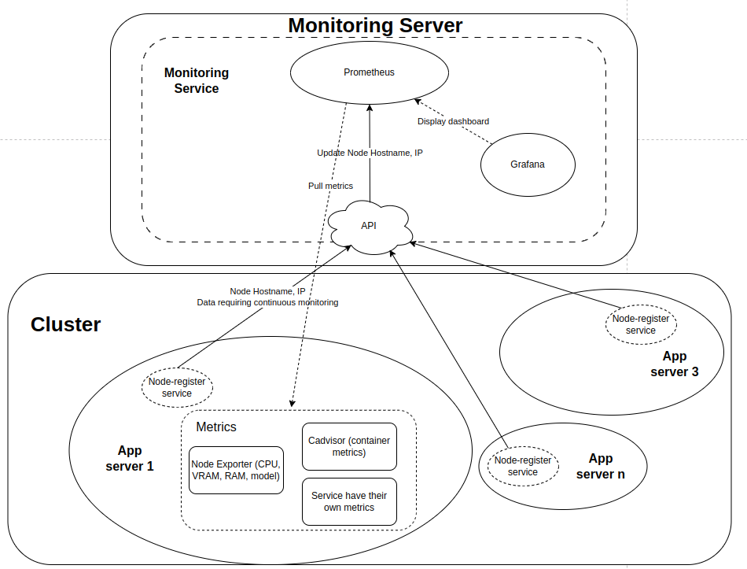
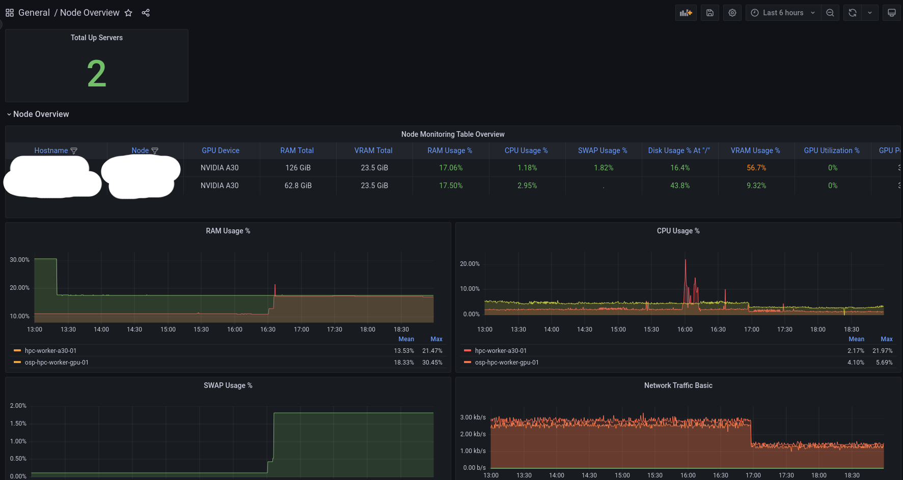
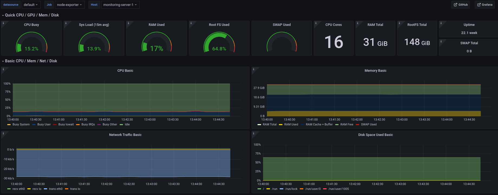
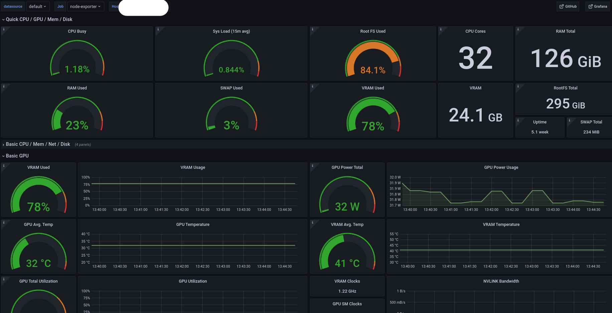
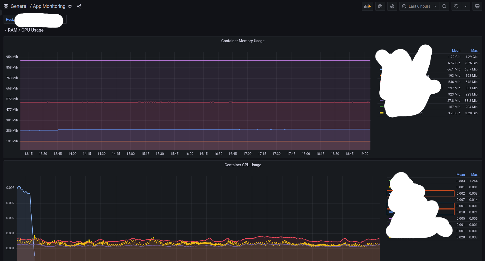
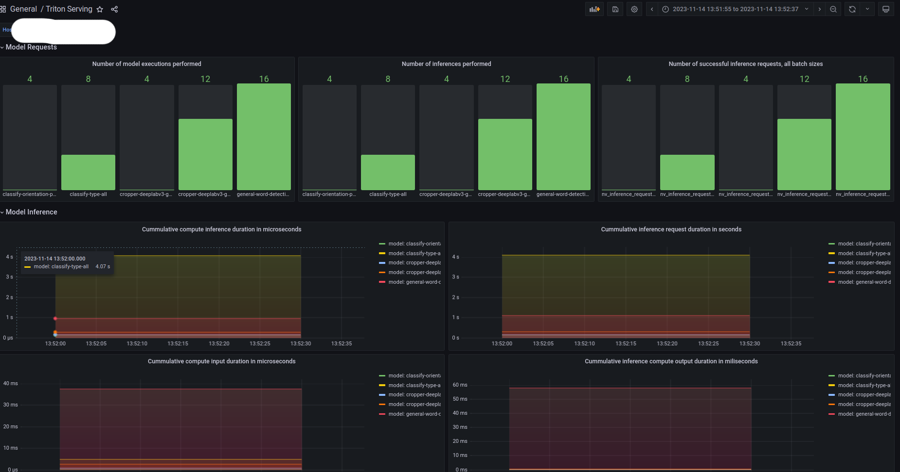

# Distributed Server Monitoring



# Table of Contents

1. [Monitoring Server Side](#1-monitoring-server-side-code-in-monitoring-side)

    1. [Monitoring service components](#11-monitoring-service-components)

    2. [Implement a Monitoring service for distributed app servers using Ansible](#12-implement-a-monitoring-service-for-distributed-app-servers-using-ansible)

    3. [Grafana Dashboard](#13-grafana-dashboard)

2. [App Servers Side](#2-app-servers-side-code-in-app-servers-side-directory)

    1. [Node Registry service component](#21-node-registry-service-component)

    2. [Implement a Node Registry service for distributed app servers using Ansible](#22-implement-a-node-registry-service-for-distributed-app-servers-using-ansible)

## 1. Monitoring Server Side (code in `monitoring-side`)

#### **Monitoring server resource requirement**: To monitor a minimum of 20 app servers, the Monitoring server should have at least 20 GB RAM and 8-core CPU.
### 1.1. Monitoring service components

+ **Prometheus**: Pulls metrics from app servers and itself, including GPU, RAM, VRAM and container metrics.
+ **Grafana**: Connects to Prometheus to generate dashboards.
+ **Monitoring server API**: Provides an API for monitored servers to send information such as IP. hostname... which updates the Prometheus configuration.

    + Using the **Monitoring server API** we can automatically update the IP addresses of new app servers for Prometheus to scrape and monitor, without restarting the monitoring server.

    + The **Monitoring server API** exposes port 8000 on 2 routes:
        + `/add_node` route, allowing newly added app servers to register for monitoring.
        + `/remove_node` route, enabling the removal of app servers that no longer require monitoring.


### 1.2. Implement a Monitoring service for distributed app servers using Ansible

**Requirements**:
+ Docker is already installed on this local machine.
```bash
cd monitoring-side/ansible
pip install -r requirements.txt
```
To establish a connection to the monitoring servers using Ansible, ensure that the `inventory` file contains accurate server IP addresses, SSH usernames, private key file paths, and SSH connection arguments. Keep in mind that the value in the `hosts` field of the playbook must correspond to the server name defined in the `inventory` file.

The Ansible playbook comprises 3 plays:
+ `Install docker`: This play installs Docker and several required packages.
+ `Run monitoring service`: This play install docker sdk, copies the `monitoring_services` directory from the repository to target server and initiates the monitoring service using the `docker-compose.yaml` file.
+ `Stop monitoring service`: This play stops container running monitoring service.

### **How-to guide**
**Update** your ansible playbook:
+ If your `remote_user` is root, simply replace the `dest` and `chdir` fields with the path destination on your server.

+ If your `remote_user` is not root, update the `dest`, `chdir` fields, replace the `remote_user` with the same `ansible_ssh_user` value in `inventory` and set `become` field to `False` to prevent privilege escalation.

**Note** If the server lacks essential packages that require root privileges, such as Docker, and you are not a root user, please consult with your supervisor or system administrator to have them install the required packages.

**Update** your Grafana username and password in `monitoring-services/.env` file.

**Update** your Monitoring server IP at `scrape_configs.targets` field in `prometheus/config/prometheus.yml`. If Monitoring server using gpu, replace `node_type` field with `gpu` value.

**Executing the provided command, you'll have the complete monitoring service up and running on your server.**
+ If your monitoring service has not yet installed Docker
```bash
cd monitoring-side/ansible
ansible-playbook -i inventory playbook.yaml --skip-tags "stop-service"
```
+ If your monitoring service has already installed Docker
```bash
cd monitoring-side/ansible
ansible-playbook -i inventory playbook.yaml --tags "run-service"
```
+ Stop your monitoring service
```bash
cd monitoring-side/ansible
ansible-playbook -i inventory playbook.yaml --tags "stop-service"
```

Or if you need to perform more complex tasks on the server, you can customize the playbook.

### 1.3. Grafana Dashboard

Access the Grafana UI at `[MONITORING_SERVER_IP]:3000` using the username and password defined in `monitoring-services/.env` file

There are 5 dashboards avaiable in Grafana:
+ Node Overiew Dashboard: Displays RAM, CPU, SWAP, and VRAM usage for each server (Sensitive information, such as hostname and node IP, is hidden)



+ CPU Node: Provides more detailed information about CPU server



+ GPU Node: Provides more detailed information about GPU server



+ Container Dashboard: Displays resource usage for all containers on each server.



+ Triton dashboard: Display metrics from service running triton serving


## 2. App Servers Side (code in `app-servers-side` directory)

#### **App servers resource requirement**:  To generate metrics from exporters, the app servers should have at least 700 MB RAM and 0.5-core CPU for running exporter containers.

If you already have app services running in docker containers on these app servers and want to monitor them, you'll need a Monitoring Server to track metrics generated by the app services and the app server's usage status, including GPU, RAM, VRAM...

*Assuming you need to monitor an application running in a container, it is presumed that the app server already has Docker installed.*

### 2.1. Node Registry service component

The node registry service in app server (`node-registry`) comprises 5 containers:
+ `dcgm-exporter`: Server GPU health metrics.
+ `node-exporter`: Server health metrics (CPU, RAM, disk I/O, etc.).
+ `cadvisor`: Metrics generated from app running in Docker containers.
+ `node-registry`: Automatically registers app server information, like IP and hostname, with the monitoring server, eliminating the need for manual configuration of Prometheus on the monitoring server. This container will make a request to the /add_note route on port 8000 of the Monitoring server API.
+ `triton-serving`: (Optinal) Metrics generated from services running triton serving.

### 2.2. Implement a Node Registry service for distributed app servers using Ansible

This Ansible playbook showcases the **automation capabilities** for tasks such as monitoring multiple app servers. When dealing with multiple or new app servers, simply specify the target app server in the Ansible command. Subsequently, the designated app servers will be monitored by the central monitoring server.

The Ansible playbook comprises 2 plays:
+ `Run node registry service`: This play installs necessary Python packages, copies the `node-registry` directory from the repository to target app server, checks the GPU or CPU on the app server, and starts the node registy service using the `docker-compose-cpu.yaml` (or `docker-compose-gpu.yaml`) file.
+ `Stop node registry service`: This play stops container running node registry service.

### **How-to guide**

To establish a connection to the target app servers using Ansible, ensure that the `inventory` file contains accurate your app server IP addresses, SSH usernames, private key file paths, and SSH connection arguments.
Keep in mind that the value in the `hosts` field of the playbook must correspond to the server name defined in the `inventory` file.

**Update** your `MONITORING_SERVERS` IP in the `node-registry/node-cpu/.env` and `node-registry/node-gpu/.env` file.

**Update** your ansible playbook
+ Update the `dest`, `chdir` fields, replace the `remote_user` with the same `ansible_ssh_user` value in `inventory`

**Executing the provided command enables the monitoring server to monitor your app servers.**

+ If you want to monitor all app server defined in inventory
```bash
ansible-playbook -i inventory -l server* playbook.yaml --tags "run-node-registry"
```
+ If you want to monitor specific app servers defined in inventory
```bash
ansible-playbook -i inventory -l 'server1, server2' playbook.yaml --tags "run-node-registry"
```
**Executing the provided command disables the monitoring server from monitoring your app servers.**
+ If you want to disable monitoring for all app servers defined in the inventory
```bash
ansible-playbook -i inventory -l server* playbook.yaml --tags "stop-node-registry"
```
+ If you want to disable monitoring for specific app servers defined in the inventory
```bash
ansible-playbook -i inventory -l 'server1' playbook.yaml --tags "stop-node-registry"
```
